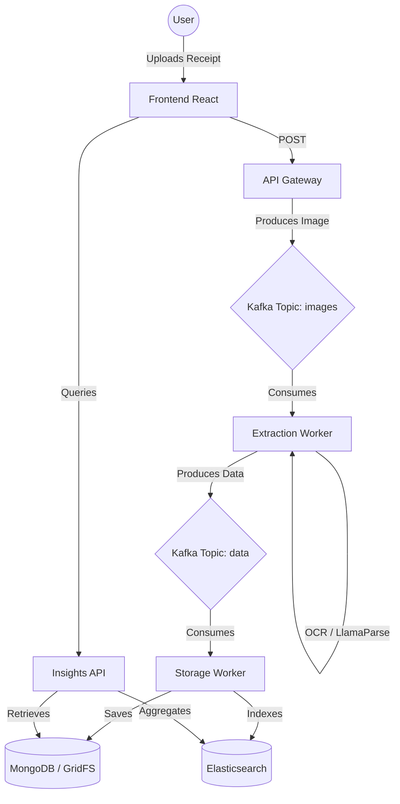

# 🖼️ ScanAnalytics: AI-Powered Receipt Intelligence

**ScanAnalytics** is a sophisticated, end-to-end receipt management and financial analytics platform. Built on an event-driven microservices architecture, it transforms raw paper receipts into structured data and actionable financial insights using high-fidelity AI extraction.

---

## 🚀 Key Features

*   **⚡ AI-Driven OCR**: Leverages **LlamaParse** for high-accuracy text extraction from complex receipt layouts.
*   **📡 Event-Driven Architecture**: Uses **Apache Kafka** to decouple ingestion from heavy AI processing, ensuring system stability.
*   **📊 Premium Analytics**: Real-time spending trends, category distribution, and store-specific analytics powered by **Elasticsearch** and **Recharts**.
*   **🔒 Dual-Layer Storage**: Securely stores original receipt images in **GridFS** (MongoDB) while maintaining searchable metadata in structured collections.
*   **🔍 Intelligent Search**: Advanced regex-based search for finding receipts by store name, category, or purchase date.
*   **📱 Modern Responsive UI**: A premium, dark-mode inspired dashboard built with **React** and **Tailwind CSS**.

---

## 🛠️ Tech Stack

| Layer | Technologies |
| :--- | :--- |
| **Frontend** | React, Vite, Tailwind CSS, Recharts, Lucide-Icons |
| **Gateway & APIs** | FastAPI, Node.js/Express, Pydantic |
| **AI & Extraction** | LlamaIndex, LlamaParse, Python |
| **Event Streaming** | Apache Kafka |
| **Storage** | MongoDB (Metadata), GridFS (Image Vault) |
| **Analytics Engine** | Elasticsearch, Kibana |
| **DevOps** | Docker, Docker Compose |

---

## 🏗️ System Architecture



---

## 🚦 Getting Started

### Prerequisites

*   [Docker Desktop](https://www.docker.com/products/docker-desktop/)
*   [LlamaCloud API Key](https://cloud.llamaindex.ai/) (Required for OCR extraction)

### Configuration

Create a `.env` file in the root directory with the following variables:

```env
LLAMA_CLOUD_API_KEY=your_api_key_here
```

### Installation & Launch

Run the entire system with a single command:

```bash
docker-compose up -d --build
```

Access the platform at:
*   **Frontend**: [http://localhost:5173](http://localhost:5173)
*   **API Gateway**: [http://localhost:8000](http://localhost:8000)
*   **Insights API**: [http://localhost:8001](http://localhost:8001)
*   **Kibana**: [http://localhost:5601](http://localhost:5601)

---

## 📂 Project Structure

*   `/Frontend`: React application (Modern UI).
*   `/api_gateway`: Python/FastAPI ingestion service.
*   `/InsightsDashboard`: Python/FastAPI analytics service (Elasticsearch).
*   `/extraction_worker`: AI/OCR processing engine.
*   `/storageWorker`: Kafka data persistence orchestrator.
*   `/backend`: Authentication and user data service.
